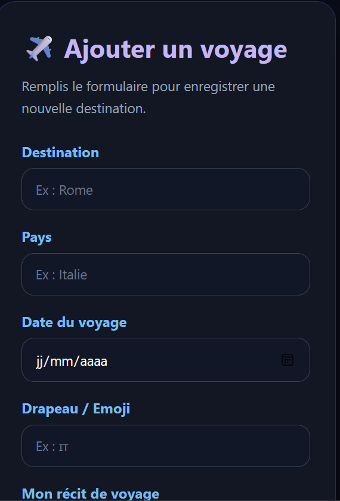
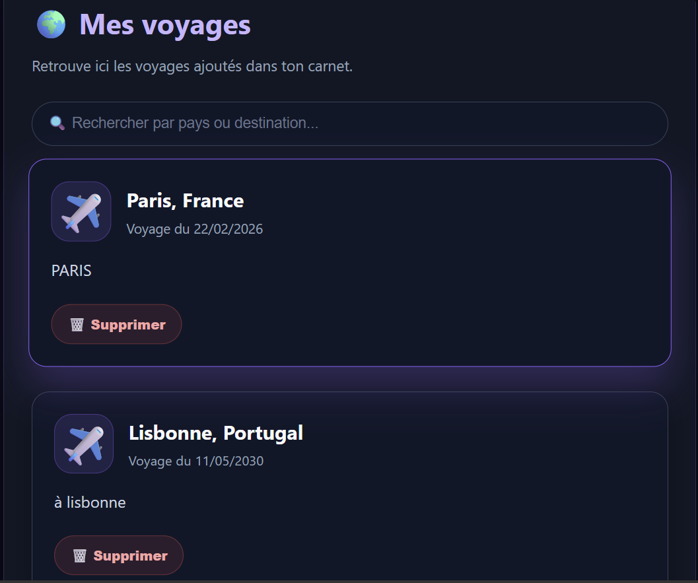

# 🌍 Mon Carnet de Voyages

Application web développée dans le cadre de la Préqualification aux Métiers du Numérique à l’AFPA Brest.

## Technologies utilisées

- HTML5
- CSS3
- JavaScript
- PHP
- MySQL

## Fonctionnalités

✅ Ajouter un voyage

✅ Afficher les voyages

✅ Rechercher par pays ou destination

✅ Supprimer un voyage

✅ Connexion base de données MySQL

✅ API REST PHP

---

## Aperçu du projet

### Page d'accueil

### Formulaire d'ajout

### Liste des voyages

---

## Auteur

Chris Ambroise Tshibangu
